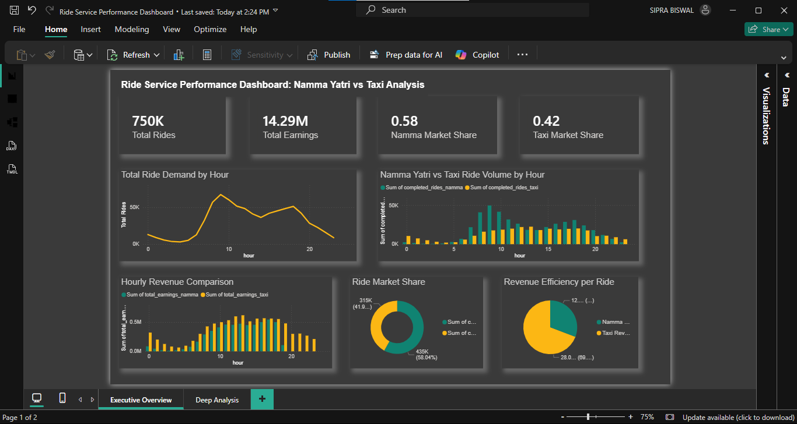
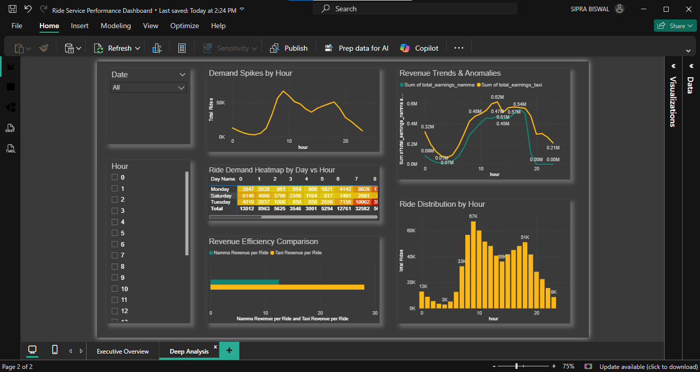

# 🚖 Ride Service Performance Analysis: Namma vs Taxi

## 📌 Project Overview

Ride-hailing companies rely heavily on data to understand demand patterns, optimize pricing strategies, and allocate drivers efficiently.

This project performs a **comparative analysis of two ride services Namma and Taxi using SQL, Python, and Power BI** to identify which platform performs better across key operational metrics such as demand, revenue generation, and efficiency.

The analysis focuses on uncovering patterns in **ride demand, revenue performance, and service dominance over time**, helping stakeholders make data-driven operational decisions.

---

## 🔄 Project Workflow

The analysis followed a structured data analytics pipeline:

Raw Data (Namma Yatri + Taxi datasets)  
↓  
Python Data Cleaning & Exploration  
↓  
Merged Dataset Creation  
↓  
SQL Analytical Queries  
↓  
Power BI Dashboard Development  
↓  
Business Insights & Recommendations

## 🎯 Business Problem

Ride service platforms need to answer several critical operational questions:

- Which service completes more rides?
- Which platform generates higher revenue?
- When are the peak demand hours?
- Which service is more efficient in terms of revenue per ride?
- How does ride demand fluctuate throughout the day?
- When does service dominance shift between competitors?

By answering these questions, companies can improve:

- Driver allocation
- Pricing strategy
- Operational efficiency
- Customer service availability

---

## ❓ Analytical Questions Explored

This project answers several analytical questions:

- What are the peak ride demand hours?
- How does ride demand fluctuate across the day?
- Which service dominates ride volume?
- Which platform generates higher revenue per ride?
- Are there sudden spikes in demand?
- When do revenue anomalies occur?
- Which hours contribute the most to total earnings?
- How does service dominance shift throughout the day?

## 📊 Dataset Description

The dataset contains **hourly ride activity data** comparing two ride services.

| Column | Description |
|------|-------------|
| DATE | Date of ride activity |
| HOUR | Hour of the day (0–23) |
| COMPLETED_RIDES_NAMMA | Number of rides completed by Namma |
| COMPLETED_RIDES_TAXI | Number of rides completed by Taxi |
| TOTAL_EARNING_NAMMA | Revenue generated by Namma |
| TOTAL_EARNING_TAXI | Revenue generated by Taxi |

### Data Characteristics

- **Granularity:** Hourly
- **Scope:** Ride demand and revenue comparison
- **Time Dimension:** Date + Hour

This dataset allows detailed **time-series analysis of ride demand and competitive performance**.

---

## 📈 Key Performance Indicators (KPIs)

Several metrics were defined to evaluate the performance of both services.

### Market Share
Proportion of total rides completed by each service.

```
Market Share = Service Rides / Total Rides
```

### Revenue per Ride
Average revenue generated per completed ride.

```
Revenue per Ride = Total Earnings / Total Rides
```
### Peak Demand Hours
Hours during which ride demand reaches its highest levels.

### Revenue Efficiency
Revenue generated per ride for each service.

### Demand Volatility
Fluctuations in ride demand across different hours.

---

## 🧹 Data Preparation (Python)

Python was used for preliminary **data inspection and exploratory analysis**.

Tasks performed:

- Data loading and validation
- Checking for missing values
- Aggregating ride metrics
- Initial demand trend exploration

Example Python snippet:

```python
import pandas as pd

df = pd.read_csv("ride_data.csv")

df["total_rides"] = df["COMPLETED_RIDES_NAMMA"] + df["COMPLETED_RIDES_TAXI"]

df.groupby("HOUR")["total_rides"].sum()
```

Python was used for preliminary exploratory data analysis (EDA) and dataset validation before performing deeper SQL analysis.

### Data Cleaning & Validation

The following steps were performed to ensure data quality before analysis:

- Verified dataset structure and column types
- Checked for missing or inconsistent values
- Validated hourly timestamp continuity
- Confirmed ride counts and revenue values were logical

## 🛠 SQL Analysis

Advanced SQL queries were used to extract insights and analyze performance patterns.

Demand Analysis

Identify peak demand hours

Detect sudden ride demand spikes

Analyze hourly ride trends

Evaluate ride demand seasonality

Revenue Analysis

Compare revenue performance between services

Identify high earning hours

Detect revenue anomalies

Calculate revenue growth trends

Competitive Analysis

Determine service market share

Identify dominance streaks

Detect shifts in service performance

Efficiency Analysis

Calculate earnings per ride

Rank services based on revenue efficiency

Advanced SQL Techniques Used

Window functions (LAG, ROW_NUMBER, RANK)

Time-series analysis

Consecutive event detection

Percentage growth calculations

Market share analysis

Example SQL query:
```
SELECT 
HOUR,
SUM(COMPLETED_RIDES_NAMMA + COMPLETED_RIDES_TAXI) AS total_rides
FROM ride_comparison
GROUP BY HOUR
ORDER BY total_rides DESC
LIMIT 5;
```
## 📊 Dashboard Visualization (Power BI)

A Power BI dashboard was built to visualize key insights.

Dashboard Components
Demand Overview

Total rides by hour

Peak demand periods

Ride comparison between services

Revenue Analysis

Revenue comparison

Revenue per ride

Hourly earnings trends

Market Competition

Market share comparison

Service dominance trends

Operational Insights

Demand spikes

Revenue anomalies

Efficiency rankings

## 📊 Dashboard Preview

### Executive Overview


### Deep Analysis


## 🔍 Key Insights

### Peak Demand Patterns

Ride demand peaks between **08:00–11:00**, reaching approximately **67K rides per hour**, indicating strong morning commuter activity.

### Market Share Dynamics

Namma accounts for **58% of total rides**, while Taxi holds **42%**, showing stronger adoption of Namma in the ride-hailing market.

### Revenue Efficiency

Taxi generates significantly higher revenue per ride, averaging **₹28 per ride**, compared to **₹12 per ride for Namma**, suggesting a premium pricing strategy.

### Demand Fluctuations

Demand drops significantly after **21:00**, indicating reduced late-night ride activity.

### Competitive Dynamics

Although Namma dominates ride volume with **58% market share**, Taxi achieves **higher revenue efficiency**, generating more revenue per ride. This indicates a trade-off between **volume leadership and pricing strategy**.

## 💡 Business Recommendations

Based on the analysis, the following operational strategies are recommended:

- Increase driver availability during **peak hours (08:00–11:00)** when demand exceeds **50K rides per hour**.

- Implement **dynamic pricing during high-demand periods** to maximize revenue.

- Optimize marketing campaigns during **low-demand hours (00:00–05:00)** to stimulate ride demand.

- Analyze Taxi's **higher revenue per ride (₹28 vs ₹12)** to understand pricing strategies that could improve Namma's profitability.

## 📂 Project Structure
Ride-Service-Analysis
│
├── data
│   └── ride_comparison.csv
│
├── sql
│   └── analysis_queries.sql
│
├── python
│   └── data_analysis.ipynb
│
├── dashboard
│   └── ride_service_performance_dashboard.pbix
│
├── images
│   ├── dashboard.png
│   └── dashboard_page2.png
│
└── README.md

## 🧰 Tools & Technologies

SQL (MySQL) – Data querying and analysis

Python (Pandas, NumPy) – Data exploration and preprocessing

Power BI – Interactive dashboards and visualizations

Time-Series Analysis – Demand and revenue trend analysis

## 🧠 Skills Demonstrated

This project demonstrates practical data analytics skills including:

- Data Cleaning & Preprocessing
- Exploratory Data Analysis (EDA)
- SQL Analytical Querying
- Window Functions & Time-Series Analysis
- Data Visualization & Dashboard Design
- Business Insight Generation
- End-to-End Data Analytics Workflow

## 🚀 Future Improvements

Potential extensions for this project include:

- Predictive demand forecasting using machine learning

- Driver supply optimization models

- Dynamic pricing simulations

- Real-time ride demand monitoring

## 📌 Conclusion

This project demonstrates how SQL, Python, and Power BI can be combined to perform end-to-end ride service performance analysis, providing valuable insights into demand patterns, revenue efficiency, and competitive dynamics.

The findings highlight opportunities for improved driver allocation, optimized pricing strategies, and enhanced operational planning for ride-hailing platforms.
